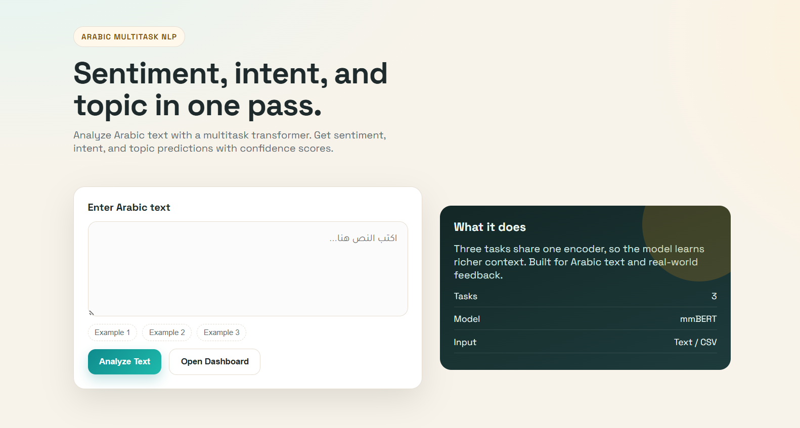
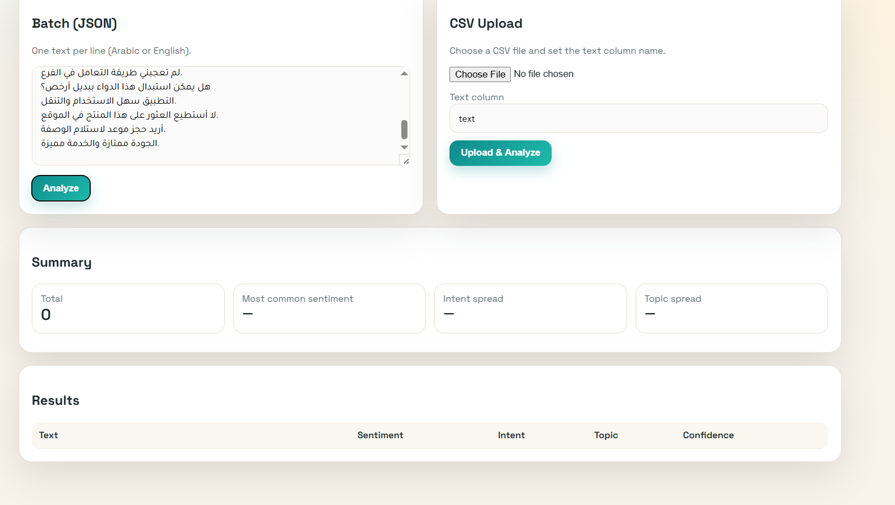

# 🧠 Arabic Multitask NLP System  
**Sentiment • Intent • Topic Classification**

Welcome to the **Arabic Multitask Text Classification System** 🚀  
This project is a **production‑ready Natural Language Processing (NLP) pipeline** designed to analyze Arabic text across **multiple semantic dimensions** using modern **transformer‑based architectures**.

Unlike traditional sentiment‑only solutions, this system performs **joint multi‑task learning**, enabling richer and more reliable understanding of Arabic text in real‑world scenarios.

---

## Demo

- Live app: https://huggingface.co/spaces/AhmedRabie01/Arabic-Multitask-Sentiment
- Model artifacts: https://huggingface.co/AhmedRabie01/arabic-multitask-model
- Data: not publicly shared (privacy constraints)

### Video Walkthroughs

<table>
  <tr>
    <td width="50%" valign="top">
      <a href="https://drive.google.com/file/d/1iKqBzoHve0qc_h80-0U9iE6l6pHGrTyJ/view?usp=drive_link">
        
      </a>
      <br>
      <strong>Single Sentence Prediction</strong>
      <br>
      Analyze one Arabic sentence and return sentiment, intent, topic, and confidence scores.
    </td>
    <td width="50%" valign="top">
      <a href="https://drive.google.com/file/d/1G7c1Yop_INXycqARekrv7YfqRBgcXwMd/view?usp=drive_link">
        
      </a>
      <br>
      <strong>Batch CSV Prediction</strong>
      <br>
      Upload a CSV of Arabic sentences and review grouped predictions with confidence values.
    </td>
  </tr>
</table>

---

## 📌 Project Overview

This is a **full end‑to‑end machine learning system**, not just a trained model.

It covers the complete ML lifecycle:
- Data ingestion from **MongoDB**
- Schema‑driven **data validation**
- Multitask **transformer model training**
- Robust, metric‑based **model evaluation**
- Safe and controlled **model promotion**
- **FastAPI**‑based inference service
- Fully **Dockerized deployment**

A strict separation is enforced between **training** and **inference** to ensure production safety and reproducibility.

---

## 🧩 Supported Tasks

### 🔹 Sentiment Classification
- `positive`
- `neutral`
- `negative`

### 🔹 Intent Detection
- `Inquiry`
- `Complaint`
- `Praise`

### 🔹 Topic Classification
- `availability`
- `delivery`
- `staff_behavior`
- `price`
- `insurance`

## 🏗 System Architecture (High‑Level)

           ┌────────────────────┐
           │     MongoDB         │
           │ (Training Only)     │
           └─────────┬──────────┘
                     │
                     ▼
          ┌──────────────────────┐
          │  Data Ingestion      │
          │  (Flatten + CSV)     │
          └─────────┬────────────┘
                     ▼
          ┌──────────────────────┐
          │  Data Validation     │
          │  (Schema-based NLP)  │
          └─────────┬────────────┘
                     ▼
          ┌──────────────────────┐
          │ Data Transformation  │
          │ Tokenizer + Labels   │
          └─────────┬────────────┘
                     ▼
          ┌──────────────────────┐
          │  Multitask Training  │
          │  Shared Encoder      │
          └─────────┬────────────┘
                     ▼
          ┌──────────────────────┐
          │  Model Evaluation    │
          │  Macro-F1 + Weights  │
          └─────────┬────────────┘
                     ▼
          ┌──────────────────────┐
          │   Model Pusher       │
          │ saved_models/ ONLY   │
          └─────────┬────────────┘
                     ▼
         ┌─────────────────────────┐
         │  FastAPI Inference API  │
         │ Loads ONLY saved_model  │         
         │       artifacts         │
         └─────────────────────────┘


### Multitask Learning Design
- Shared **Transformer encoder**
- Independent task‑specific classification heads
- Joint optimization improves generalization and label efficiency

Designed with **clarity, traceability, and production stability** in mind.

---

## 🧪 Training Pipeline

### 🔹 Data Ingestion
- Reads Arabic text data from MongoDB
- Exports a clean CSV feature store
- Performs deterministic train/test splitting

### 🔹 Data Validation
- Schema‑aware validation
- Ensures required columns and labels exist
- Detects missing or invalid samples
- Produces YAML validation reports

### 🔹 Data Transformation
- Arabic tokenization using **mBERT tokenizer**
- Shared input tensors for all tasks
- Separate label tensors per classification head

### 🔹 Model Training
- Multitask transformer architecture
- Three independent classification heads
- Class weighting applied to mitigate label imbalance

### 🔹 Model Evaluation
- Task‑wise evaluation
- **Macro‑F1** used to fairly assess imbalanced classes
- Composite weighted score for model selection
- Model is accepted only if it outperforms the current production model

### 🔹 Model Pusher
- Deploys **only validated and approved models**
- Updates `saved_models/`
- Guarantees inference‑time consistency

---

## 🌐 Inference API (FastAPI)

### Available Endpoints

| Endpoint | Description |
|--------|------------|
| `/predict/single` | Predict labels for a single Arabic text |
| `/predict/batch/csv` | Batch prediction using a CSV file |
| `/train` | Manually trigger model training (optional) |

### Example Response

```json
{
  "sentiment": "neutral",
  "intent": "Inquiry",
  "topic": "availability",
  "confidence": {
    "sentiment": 92.3,
    "intent": 88.7,
    "topic": 90.1
  }
}
```

### Quick Test

```bash
curl -X POST http://localhost:8080/predict \
  -H "Content-Type: application/x-www-form-urlencoded" \
  -d "text=أحتاج استفسار عن توافر الدواء"
```

---

## ⚙️ Setup & Installation

### 1️⃣ Clone the Repository
```bash
git clone https://github.com/AhmedRabie01/Arabic-Sentiment-Analysis-using-Arabic-BERT.git
cd Arabic-Sentiment-Analysis-using-Arabic-BERT
```

### 2️⃣ Create Virtual Environment
```bash
conda create --name arabic-nlp python=3.11 -c conda-forge
```

### 3️⃣ Activate Environment
```bash
conda activate arabic-nlp
```

### 4️⃣ Install Dependencies
```bash
pip install -r requirements.txt
```

### 5️⃣ Start the Application
```bash
uvicorn main:app --reload
```

---

## 🐳 Docker Deployment

### Build Docker Image
```bash
docker build -t arabic-nlp .
```

### Run Container
```bash
docker run -p 8080:8080 arabic-nlp
```

### Run with Docker Compose
```bash
docker compose up --build
```

Stop the container:
```bash
docker compose down
```

---

## ✅ Key Highlights

- Production‑grade ML architecture
- Multitask transformer modeling
- Robust validation and gating logic
- Clean, maintainable codebase
- Ready for real‑world Arabic NLP workloads

---

**Author:** Ahmed Rabie  
**Focus:** Applied NLP • MLOps • Production ML Systems
